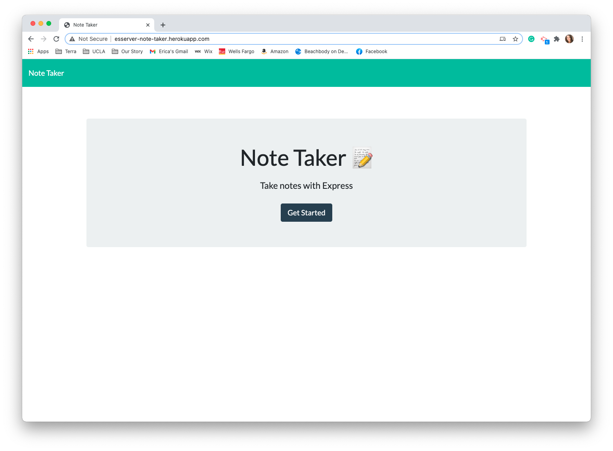
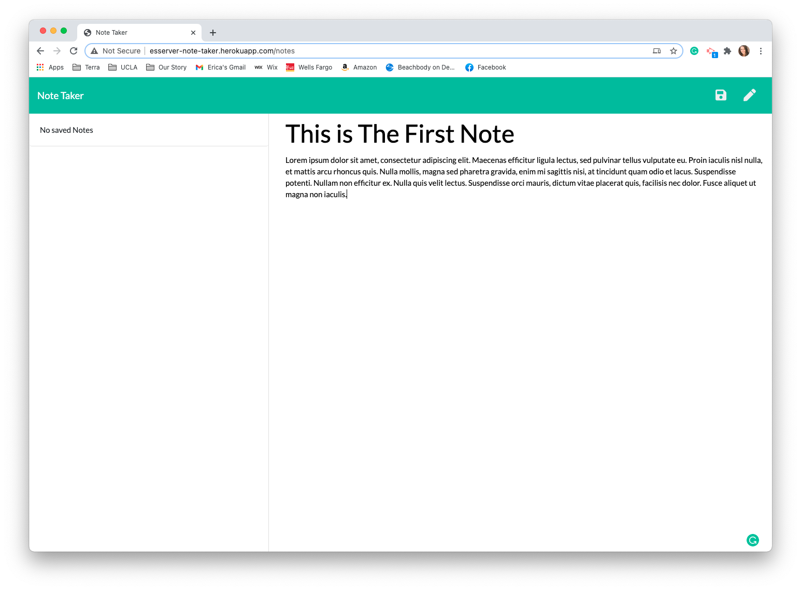
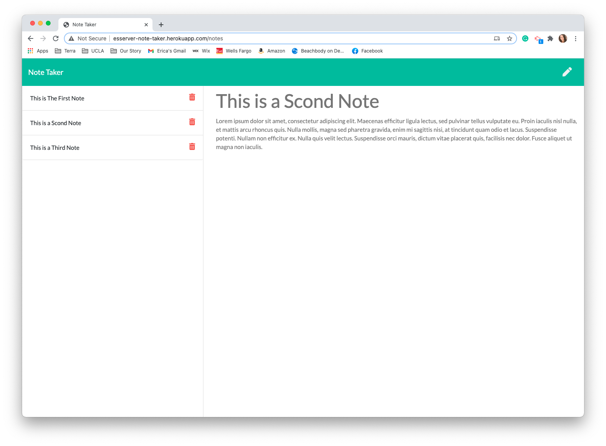
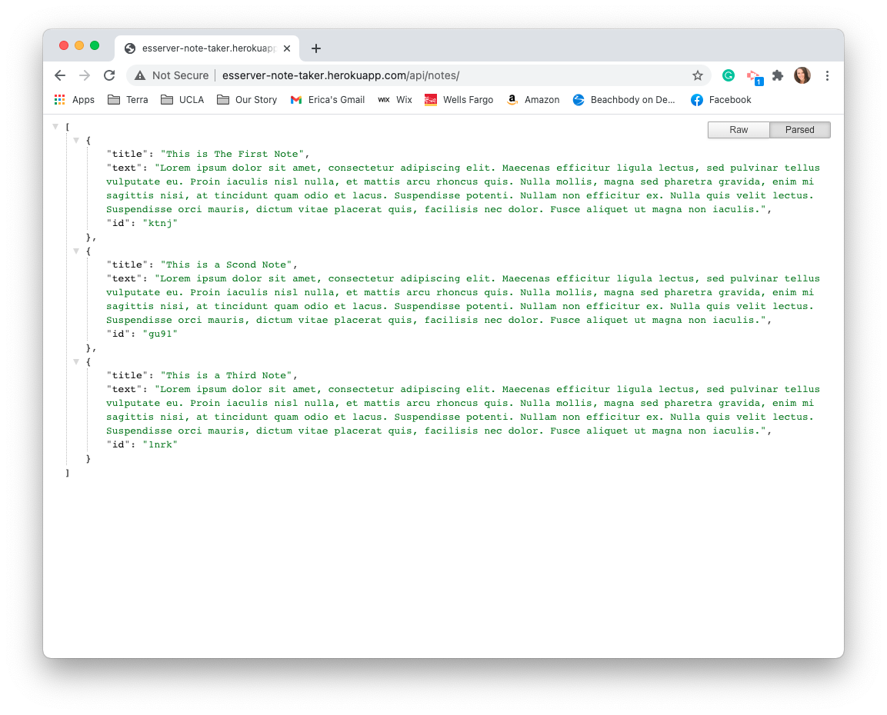

# THE NOTE TAKER

## Description 

The goal was to create an application that allows the user to write and save their notes. Using Express.js I wrote a back end to an already existing front end to create the server functionality of the Note Taker app. This app is able to submit, retrieve and delete data from a server. The application is deployed on Heroku.

Created an application that allowes the user to input notes and save them to a server. Once the user inputs the note, the save button will appear, and when they click it, the note will be saved to the server and it's title will appear in the left column of the app. If the user wishes to retrieve the note, they can click it and the tile and text of the note will appear in the right hand column. The user can then click the pencil to be able to input a new note. When the user is ready to delete the note, they can click the trash icon and the note will be removed.

## Table of Contents

* [Languages](#languages)
* [Usage](#usage)
* [Credits](#credits)
* [License](#license)

## Languages and Features

JavaScript, ES6, Node.js, Express, Heroku

## Links

[The Note Taker GitHub](https://github.com/ericasiegel/the-note-taker.git)

[The Note Taker APP](http://esserver-note-taker.herokuapp.com/)

[The Note Taker API](http://esserver-note-taker.herokuapp.com/api/notes)

## Usage 

- Navigate to the [main page](http://esserver-note-taker.herokuapp.com/)
- Click on the "Get Started" button.
- Click on "Note Title" and type in a title for your note.
- Click on "Note Text" to write the context of the note.
- Save the note by clicking on the save icon in the right hand corner.
- Click on the saved note in the left column to bring it into the main column.
- Click on the pencil icon to write a new note.
- Click on the trash icon to delete the note.

### The Note Taker Landing Page

### Entering First Note in Blank App

### Saved Notes

### The Note Taker API with Saved Notes

## Credits

- [node.js](https://nodejs.org/en/)
- [Express.js](https://expressjs.com/)
- [Heroku](http://heroku.com)

